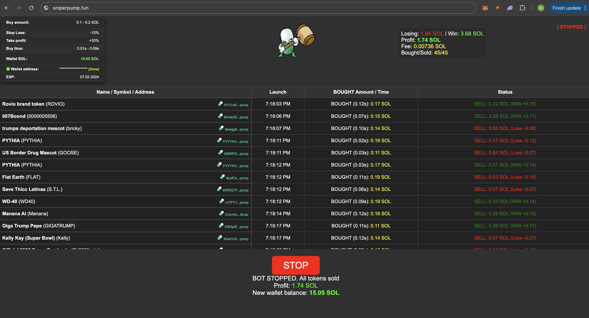

## Pump.fun Snipper Bot https://sniperpump.fun/

Welcome to the Pump.fun Solana Trading Bot! This tool, developed by TreeCityWes.eth of HashHead.io, is designed for trading and sniping new token launches on pump.fun. It includes strategies for buying and selling tokens based on market cap changes and bonding curve progress.

## Overview

The Solana Trading Bot helps you trade tokens on the Pump.fun on Solana blockchain based on bonding curves and market cap changes. The bot scrapes data to identify new tokens with favorable bonding curves, monitors market cap changes, and makes decisions on when to sell to maximize profits.

## Trading Strategy

- **Initial Buy**: The bot scrapes pump.fun to identify new token pairs with favorable bonding curves.
- **Monitoring**: Once a token is bought, the bot monitors the market cap and bonding curve progress.
- **Profit Targets**: 
  - The bot aims to take profit at a 25% increase and then again at another 25% increase.
  - It sells 50% of the tokens at the first 25% increase and 75% of the remaining tokens at the next 25% increase.
- **Stop Loss**: The bot will sell all tokens if the market cap falls by 10%.
- **Bonding Curve**: The bot will sell 75% of the tokens if the bonding curve reaches a critical level and keep 25% as a moon bag.
- **Timing**: The bot resets the timer if the price goes up and monitors the trade for a set period, adjusting its actions based on market conditions.

  ## https://sniperpump.fun
  
  
  
  Fastest Pump.fun Sniper Bot
  Our Sniper BOT scans tokens launched on Pump.fun in real time, allowing us to buy and sell the moment they go live. Regular users will only see newly launched coins after 60 seconds, but our BOT detects them in just 0.01 seconds and can execute a purchase in as little as 0.05 seconds. It then waits at least 8 seconds before selling for maximum profit.
Pump.fun Solana Trading and Sniping Bot
Welcome to the Pump.fun Solana Trading Bot! This tool is designed for trading and sniping new token launches on Pump.fun. It includes advanced strategies for buying and selling tokens based on market cap changes and bonding curve progress.

 Overview
 The Solana Trading Bot helps you trade tokens on the Pump.fun platform by leveraging bonding curves and market cap changes. The bot scrapes data to identify new tokens with favorable bonding curves, monitors market cap changes in real-time, and makes intelligent decisions on when to sell to maximize profits.

 Trading Strategy
The bot employs a sophisticated trading strategy to ensure optimal performance:

Initial Buy: The bot scrapes Pump.fun to identify new token pairs with favorable bonding curves and executes the initial buy.
Monitoring: Once a token is purchased, the bot continuously monitors the market cap and bonding curve progress.
Profit Targets:
The bot aims to take profit at a 25% increase and then again at another 25% increase.
It sells 100% of the tokens at the first selected increase.
Stop Loss: The bot will sell all tokens if the market cap falls by 10% / 30% to minimize losses.
Bonding Curve: The bot will sell 75% of the tokens if the bonding curve reaches a critical level, keeping 25% as a moon bag for potential future gains.
Timing: The bot resets the timer if the price goes up and monitors the trade for a set period, adjusting its actions based on real-time market conditions.
With these strategies, the Pump.fun Solana Trading Bot ensures you stay ahead in the fast-paced world of Solana trading, maximizing profits while minimizing risks.

If you are looking for a fast and reliable way to capitalize on trending tokens on Pump.fun, our Pump.fun Sniper Bot is the ultimate tool for you. Designed for both beginners and experienced traders, our bot offers a seamless and user-friendly experience, allowing you to customize your trading strategy and start sniping tokens in just a few clicks.

With our High-Speed Pump.fun Sniper Bot, you don’t need to be a crypto expert to stay ahead of the game. Whether you are looking to snipe new launches or ride the wave of trending tokens, our bot ensures you never miss an opportunity. Plus, we prioritize your security and privacy—every transaction is protected by advanced encryption, so you can trade with confidence knowing your assets are safe.

Say goodbye to unreliable free tools and overpriced solutions. Our bot is designed to deliver top performance without breaking the bank. It’s fast, efficient, and tailored to meet your trading needs, giving you the edge you need to succeed in the competitive world of Pump.fun.

Why wait? Start maximizing your profits today with the Pump.fun Sniper Bot—the smart choice for serious traders.

Ready to learn more? Check out our detailed guide to see how our bot can transform your trading experience.

